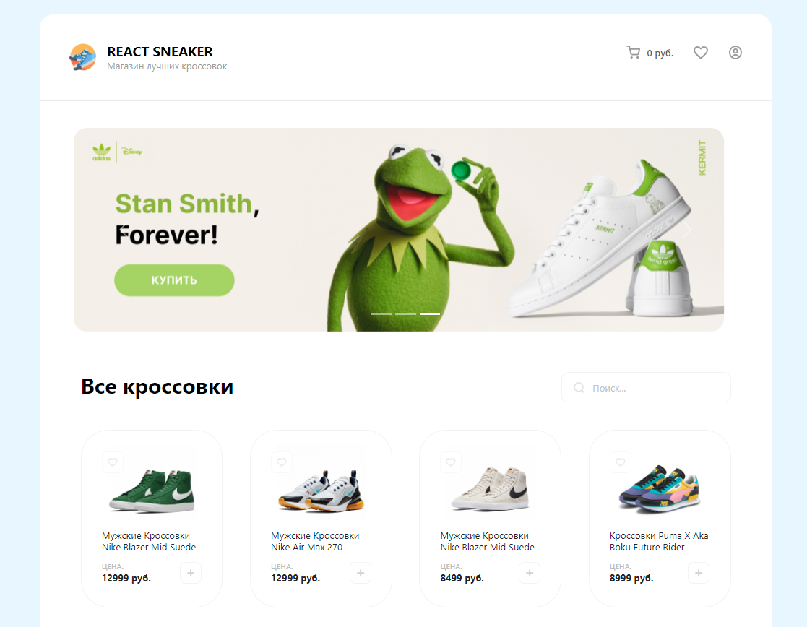
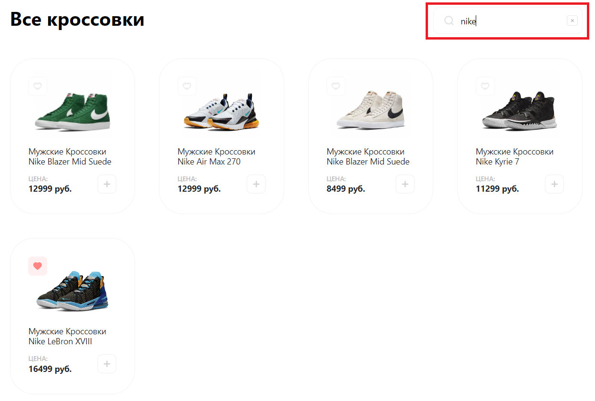
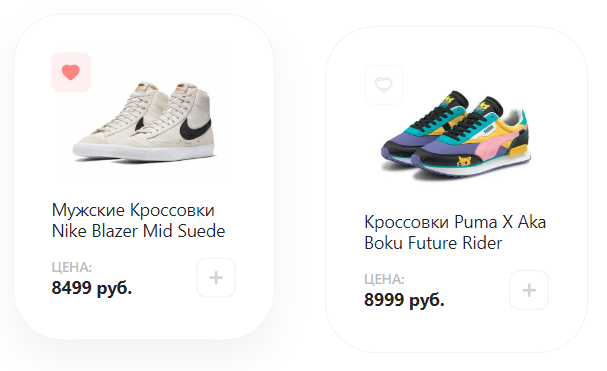
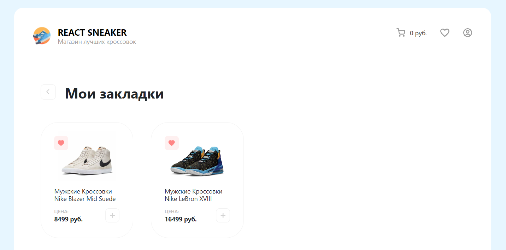
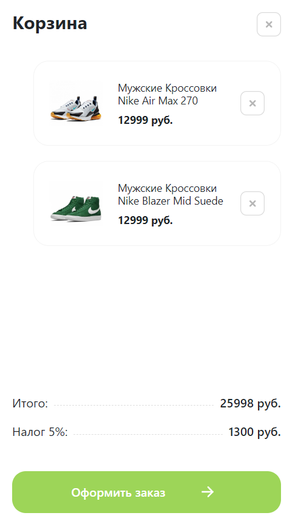
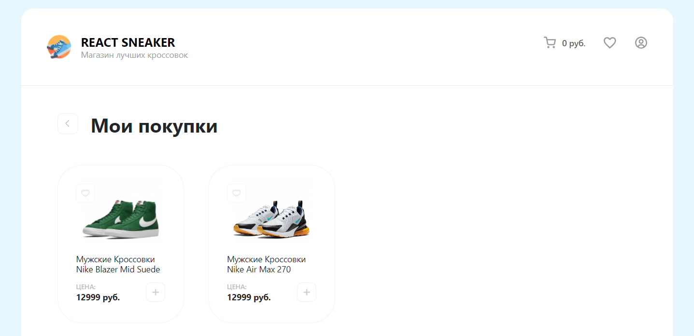

# Веб-приложение React Sneakers

https://weather-redux-app.vercel.app/ - ссылка на проект
## Инструкция по запуску проекта

1. Сначала склонируйте проект себе на локальное устройство. Например, это можно сделать с помощью HTTPS. Команда для клонирования проекта: 
```
git clone https://github.com/Emil-Ka/weather-redux-app.git
```
2. Убедитесь, что у вас установлена NodeJS. Сайт для скачивания: https://nodejs.org/ru/ Чтобы проверить, установлен ли NodeJS, можно воспользоваться командой:
```
node -v
```
3. Установите все зависимости с помощью команды:
```
npm ci
```
4. Запустите проект с помощью команды:
```
npm start
```

## Описание проекта
* Главная страница со слайдером и ассортиментом кроссовок

* Реализован поиск по кроссовкам.

* Каждый кроссовок можно лайкнуть, для этого нужно нажать на сердечко в верхнем левом углу, после этого обувь отправится в закладки


* Также любой кроссовок можно добавить в корзину. После оформления заказа купленные кроссовки попадают в список "Мои покупки"

